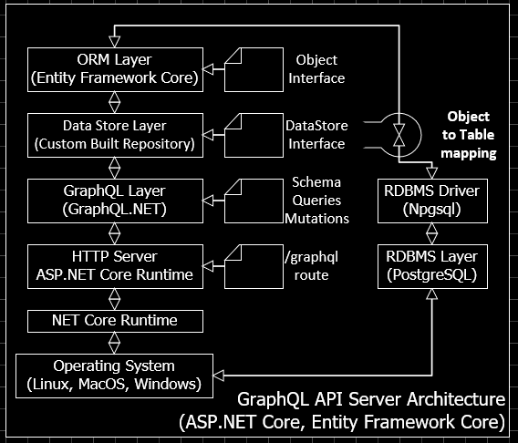
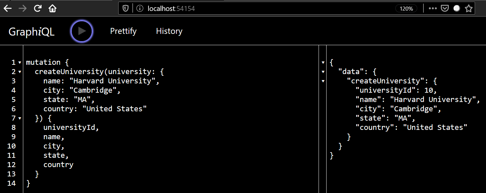
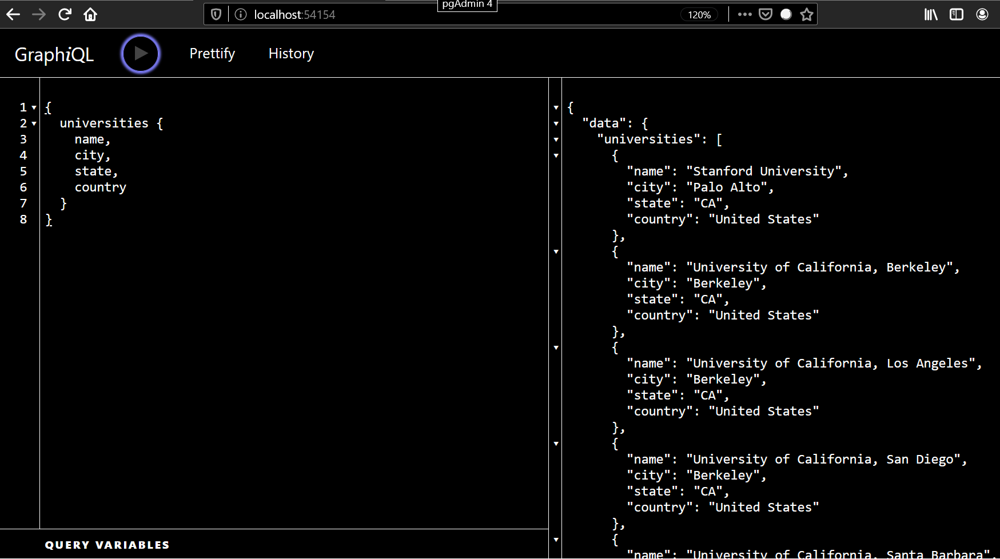
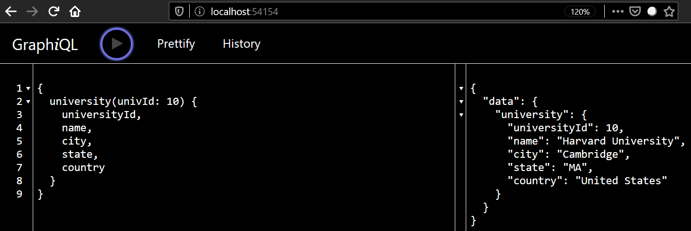
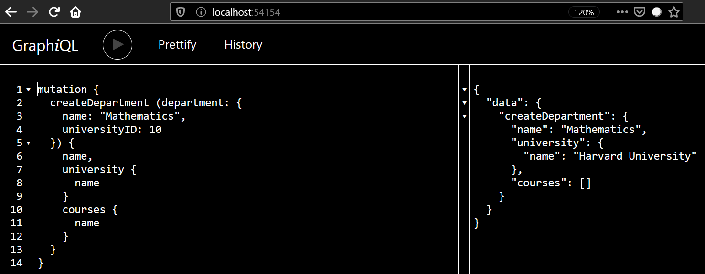
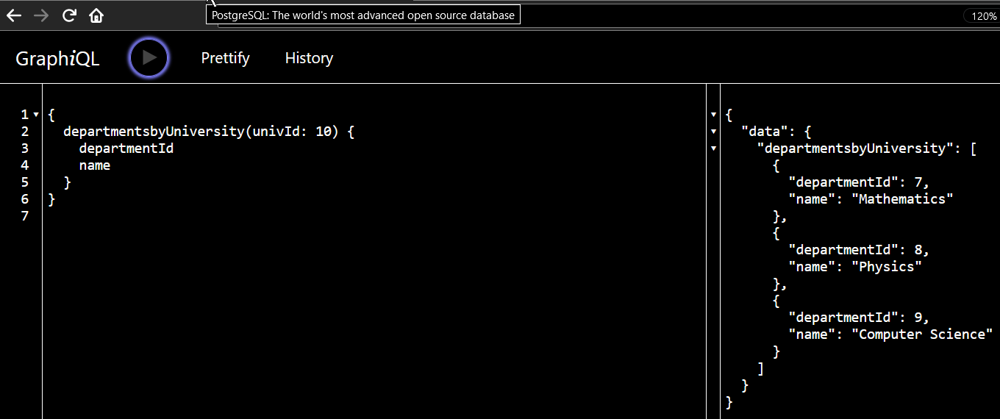
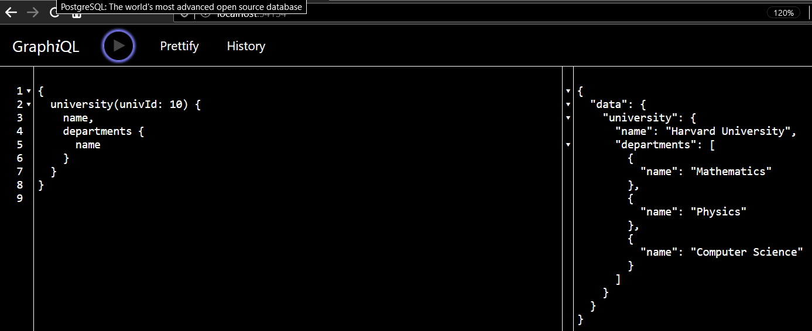

Introduction
============

Description
-----------

### Server

A GraphQL server example built with the following technologies:

-   *ASP.NET Core*. Open-source version of ASP.NET, that runs on Windows, Linux,
    macOS, and Docker.

-   *graphql-dotnet*. An implementation of Facebook's GraphQL in .NET.

-   *Entity Framework Core*. Lightweight, extensible, open source and
    cross-platform version of the Entity Framework data access technology.

-   *PostgreSQL*. PostgreSQL is an open source object-relational database
    system.

Installation and running
------------------------

-   Github server repository:
    [graphql-efcore-aspnetcore-postgres-server](https://github.com/drfausto/graphql-efcore-aspnetcore-postgres-server).

### Server

-   \$ cd server-dir

-   \$ dotnet restore

-   \$ dotnet run

~~~~~~~~~~~~~~~~~~~~~~~~~~~~~~~~~~~~~~~~~~~~~~~~~~~~~~~~~~~~~~~~~~~~~~~~~~~~~~~~
You can test GraphQL API on localhost:54154.
~~~~~~~~~~~~~~~~~~~~~~~~~~~~~~~~~~~~~~~~~~~~~~~~~~~~~~~~~~~~~~~~~~~~~~~~~~~~~~~~

Implementation
==============

Architecture
------------

### Notes

-   It is very easy to change DB server. Thanks to EF Core.

    -   You will need to change connection string on CourseContext class.

-   .NET Core cross platform runtime allows you to use Linux, Mac or Windows
    machines.

-   Dependency injection feature used extensively, see Startup class.

Code base
---------

Server implementation is based on great article from:

-   GraphQL with ASP.NET Core - A 10 Part Blog Series

    -   <https://github.com/fiyazbinhasan/GraphQLCore>

Graphql Api
-----------

Testing the server on GraphQL Playground.

### Mutations

-   Create university

### Queries

-   Get the list of universities

-   Get university by id

### Testing associations

-   Create department

-   Query departments by university id

-   Resolve departments field of an university

Notes
-----

Of course, it is just an example, nothing to put in production in a bank.

### Server

-   Initial project created with Visual Studio 2019 Community Edition.

-   Implemented a custom Data Store that gives access to EF Core entities.

-   GraphQL integration to EF Core is not as mature as GraphQL/TypeORM one. You
    need to define schema and implement a GraphQL middleware.

Todo
----

-   Implementing mutations for deleting and updating records.

-   Implementing pagination.

-   Implementing GraphQL subscriptions.

-   Implementing robust error management.

References
==========

-   Beginning Entity Framework Core 2.0. Database Access from .NET book.

-   Net Core in Action, ASP.Net Core in Action and Entity Framework Core in
    Action books.

-   Excellent book on dependency injection: Dependency Injection in .NET Core
    2.0.

~~~~~~~~~~~~~~~~~~~~~~~~~~~~~~~~~~~~~~~~~~~~~~~~~~~~~~~~~~~~~~~~~~~~~~~~~~~~~~~~

~~~~~~~~~~~~~~~~~~~~~~~~~~~~~~~~~~~~~~~~~~~~~~~~~~~~~~~~~~~~~~~~~~~~~~~~~~~~~~~~
